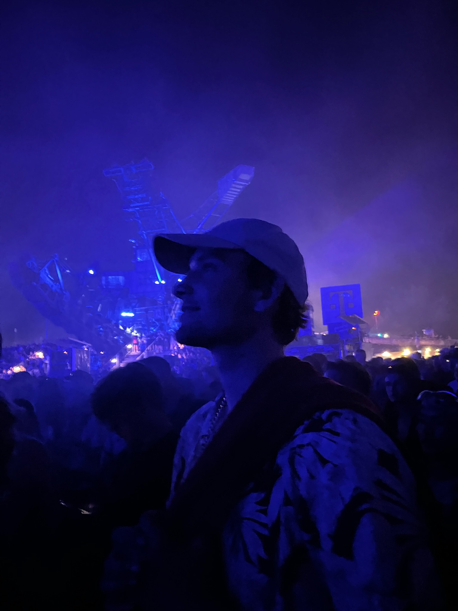

# TillWad – Portfolio & Automation Showcase



> Moderner Portfolio-Auftritt von Till Wadehn – Full Stack Entwickler aus Berlin – mit Fokus auf digitale Produkte, Automationen und skalierbare Prozesse.


## Highlights
- Statement-Hero mit Profil, Elevator-Pitch und direktem Kontakt-CTA.
- Projekte-Sektion mit interaktiven Cards, Fokus-Tags und externen Case-Study-Links.
- Floating Dock für Social Links sowie ein persistenter Dark/Light-Mode Switch mit LocalStorage.
- Smooth Framer-Like Hover States und lineare Gradienten für eigenständigen Look.
- Responsives Layout für Desktop, Tablet und Mobile.

## Tech Stack
- Next.js 16 (App Router, React 19, Client Components)
- Tailwind CSS 4 für Utility-First Styling und moderne Design Tokens
- TypeScript 5 für typisierte Komponenten
- lucide-react Icons für Social- und UI-Symbole

## Seitenaufbau
- `Hero`: Vorstellung, Standort und Expertise von Till inkl. Kontakt-CTA.
- `Recent Work`: Grid mit ausgewählten Projekten und Tech-Fokus.
- `Floating Dock`: Sticky Social Links + Theme Switch, die sich beim Scrollen in den Footer ausblenden.
- `Footer`: Direkte Kontaktmöglichkeiten & Social Media.

## Getting Started
1. Stelle sicher, dass Node.js ≥ 18 installiert ist.
2. Abhängigkeiten installieren:
   ```bash
   npm install
   ```
3. Entwicklungsserver starten:
   ```bash
   npm run dev
   ```
   Der Server läuft anschließend auf `http://localhost:3000`.
4. Production Build:
   ```bash
   npm run build
   npm start
   ```
5. Linting:
   ```bash
   npm run lint
   ```

## Anpassungen
- Projekte, Texte und Social Links befinden sich in `app/page.tsx`.
- Globale Styles, Animationsklassen und Dark-Theme-Primitives liegen in `app/globals.css`.
- Assets & Bilder werden unter `public/` verwaltet; das Profilfoto liegt z. B. in `public/images/profile-picture.jpg`.

## Deployment
- Ideal für Vercel: Repository verbinden, Build Command `npm run build`, Output `.next`.
- Alternativ jeden Node-kompatiblen Hoster nutzen (z. B. Netlify mit Next-Adapter).
